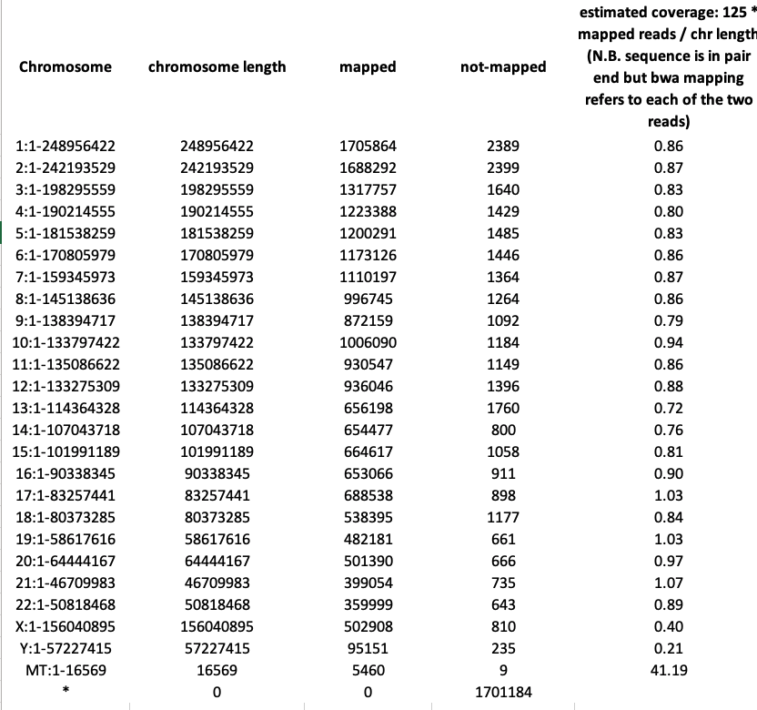

# B2
This file summarises the procedure used for the analysis of the B2 fastq files deposited by [Cattonaro et al](https://f1000research.com/articles/7-1767/v1) on the ENA: [SRP163096](https://www.ebi.ac.uk/ena/data/view/PRJNA493815)
Fastq files were retrived for sample B2.
Analysis were run using SeqBox ecosystem [Beccuti et al.](https://www.ncbi.nlm.nih.gov/pubmed/29069297)
Fastq fle R1 and R2 were mapped on hg38 human genome using bwa software [Jo and Koh](https://www.ncbi.nlm.nih.gov/pubmed/26405948).

```
library(docker4seq)
bwa(group = "docker", fastq.folder = getwd(),
  scratch.folder = "/data/scratch", genome.folder = "/data/genomes/hg38bwa", genome.name = "genome.fa",
  seq.type = "pe", threads = 8, sample.id = "B2")
```

Hg38 indexing was generated using the bwaIndex functin implemented in docker4seq package [Kulkarni et al 2018](https://www.ncbi.nlm.nih.gov/pubmed/30367595)

```
library(docker4seq)
bwaIndex(group="docker", genome.folder=getwd(), genome.url="ftp://ftp.ensembl.org/pub/release-94/fasta/homo_sapiens/dna/Homo_sapiens.GRCh38.dna.toplevel.fa.gz", mode="General")
```

File **dedup_reads.stats.xlsx** contains the statistics on mapping produced with [SAMTOOLS](http://samtools.sourceforge.net/) with the command **samtools idxstats**




As output the docker4seq **bwa** functin extract also the unmapped reads: [sorted_unmapped_R1.fastq.gz](http://130.192.119.59/public/B2-sorted_unmapped_R1.fastq.gz), [sorted_unmapped_R2.fastq.gz](http://130.192.119.59/public/B2-sorted_unmapped_R2.fastq.gz)

The unmapped files were analysed with [kraken2](https://ccb.jhu.edu/software/kraken2/) using the [8GB Kraken 2 Database built from the Refseq bacteria, archaea, and viral libraries and the GRCh38 human genome](https://ccb.jhu.edu/software/kraken2/dl/minikraken2_v2_8GB.tgz)

The kraken2 was embedded in a docker container (docker.io/repbioinfo/kraken.2019.01) and analysis was run using default parameters with the following commands:

```
ID=$(docker run  -i -t -v /data/genomes/minikraken:/reference -v /data/corvelva/B2:/data -v /data/scratch:/scratch -d docker.io/repbioinfo/kraken.2019.01 /bin/bash)
docker attach $ID
```
Passing as parameters the two unmapped fastq coming from the bwa mapping to human genome and the numbero threads
```
/bin/kraken_run.sh sorted_unmapped_R1.fastq.gz sorted_unmapped_R2.fastq.gz 8
```
The output of kraken is available in the file **B2_kraken2.report.xlsx**


